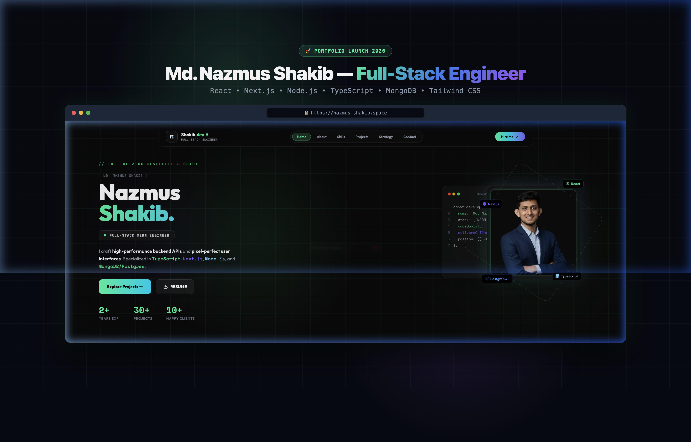

# 🚀 Md. Nazmus Shakib — Full-Stack Developer Portfolio



<div align="center">

[](https://nazmus-shakib.space)
[](https://nextjs.org/)
[](https://tailwindcss.com/)
[](./LICENSE)

</div>

---

## 📖 Overview

Welcome to the official repository for **Md. Nazmus Shakib's** personal portfolio website ([**nazmus-shakib.space**](https://nazmus-shakib.space)). 

Built from the ground up using **Next.js 16 (App Router)**, **Tailwind CSS**, and **Framer Motion**, this portfolio serves as an interactive showcase of full-stack engineering projects, technical capabilities, architectural philosophy, and direct client contact methods.

---

## ✨ Key Features & Architecture

- 🏝️ **Floating Island Navbar:** A responsive, glassmorphic floating navbar that morphs smoothly on scroll, complete with Framer Motion `layoutId="activePill"` scroll-spy section tracking.
- 🎯 **Dual-Ring Precision Custom Cursor:** High-performance custom pointer with spring physics and interactive element scaling.
- 💻 **Hero Section:** Interactive developer session badge, real-time availability indicator, live stats counters, and quick CTA buttons.
- 👤 **About Me:** Glassmorphic layout featuring core engineering principles, live status card, contact chips, and resume download.
- ⚡ **Skills & Tech Stack Grid:** Categorized technical stack covering Frontend, Backend, Databases, and Infrastructure.
- 📂 **Featured Projects Showcase:** Dedicated dynamic project pages (`/projects/[id]`), interactive quick-view modal, live application links, and 1-click client GitHub repo access.
- 🗺️ **Strategy & Process Roadmap:** 6-step structured development workflow cards with deliverables grids and accent glow bars.
- 📬 **Direct Contact & Hire Me Section:** 1-click direct action cards for **Email**, **Phone**, and **WhatsApp**, alongside a project inquiry form.

---

## 🛠️ Tech Stack & Dependencies

| Category | Technology |
| :--- | :--- |
| **Framework** | [Next.js 16](https://nextjs.org/) (App Router & Turbopack) |
| **Language** | [JavaScript (ES6+)](https://developer.mozilla.org/en-US/docs/Web/JavaScript) / [TypeScript](https://www.typescriptlang.org/) |
| **Styling** | [Tailwind CSS v4](https://tailwindcss.com/) & Vanilla Glassmorphism CSS |
| **Animations** | [Framer Motion / Motion](https://motion.dev/) |
| **Icons** | [Lucide React](https://lucide.dev/) & [React Icons](https://react-icons.github.io/react-icons/) |
| **Deployment** | [Vercel Platform](https://vercel.com/) |

---

## 📁 Directory Structure

```
portfolio-02/
├── public/
│   ├── linkedin_portfolio_launch_banner.png  # High-res LinkedIn launch banner
│   ├── logo-concept-2.svg                   # Monogram brand mark
│   ├── nomad_ai_landing.png                 # Project preview assets
│   ├── sparklift_landing.png
│   └── bloodbridge_landing.png
├── src/
│   ├── app/
│   │   ├── layout.jsx                        # Root App Router layout & metadata
│   │   ├── page.jsx                          # Main single-page portfolio
│   │   ├── globals.css                       # Global design tokens & utility styles
│   │   └── projects/
│   │       └── [id]/page.jsx                 # Dynamic dedicated project route
│   ├── components/
│   │   ├── Navbar.jsx                        # Floating glass island navbar
│   │   ├── Hero.jsx                          # Main hero banner section
│   │   ├── About.jsx                         # About Me & principles section
│   │   ├── Skills.jsx                        # Tech stack skills grid
│   │   ├── Projects.jsx                      # Projects showcase & modal
│   │   ├── Strategy.jsx                      # 6-step strategy roadmap
│   │   ├── Contact.jsx                       # Direct contact & inquiry form
│   │   ├── Footer.jsx                        # Footer & back-to-top CTA
│   │   ├── CustomCursor.jsx                  # Dual-ring mouse pointer cursor
│   │   └── ProjectDetailContent.jsx          # Dedicated project page viewer
│   └── data/
│       └── projectsData.js                   # Project metadata & case studies
├── package.json
└── README.md
```

---

## 🚀 Local Development Setup

To run this project locally on your machine:

1. **Clone the repository:**
   ```bash
   git clone https://github.com/shakibn2004/Portfolio-02.git
   cd Portfolio-02
   ```

2. **Install dependencies:**
   ```bash
   npm install
   ```

3. **Run the development server:**
   ```bash
   npm run dev
   ```

4. **Open your browser:**
   Navigate to [http://localhost:3000](http://localhost:3000) to view the application live.

---

## 📦 Production Build & Deployment

To verify and create an optimized production build:

```bash
npm run build
npm run start
```

This project is automatically deployed on Vercel:
🌐 **Production URL:** [https://nazmus-shakib.space](https://nazmus-shakib.space)

---

## 🤝 Connect & Contact

- **Website:** [nazmus-shakib.space](https://nazmus-shakib.space)
- **GitHub:** [@shakibn2004](https://github.com/shakibn2004)
- **LinkedIn:** [Md. Nazmus Shakib](https://www.linkedin.com/in/shakibn2004/)
- **Email:** [shakibn2004@gmail.com](mailto:shakibn2004@gmail.com)
- **WhatsApp:** [+880 1302230277](https://wa.me/8801302230277)

---

<div align="center">
  <sub>Designed &amp; Developed with ❤️ by <strong>Md. Nazmus Shakib</strong>. © 2026 All Rights Reserved.</sub>
</div>
